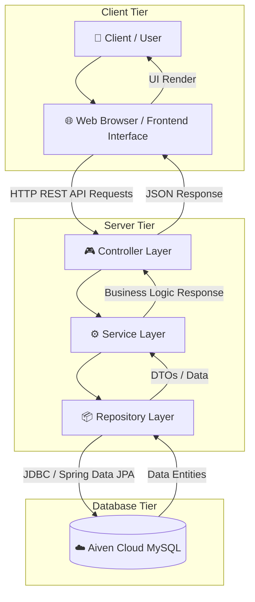
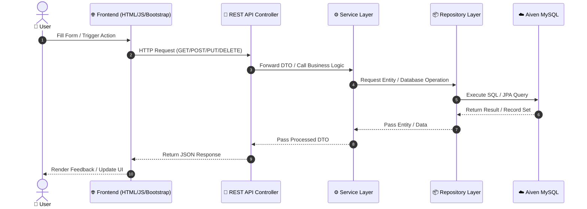
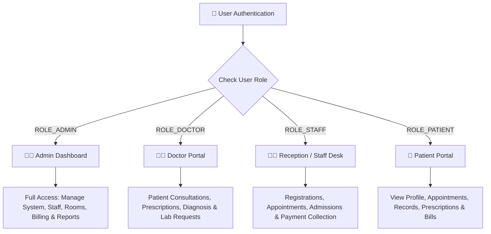
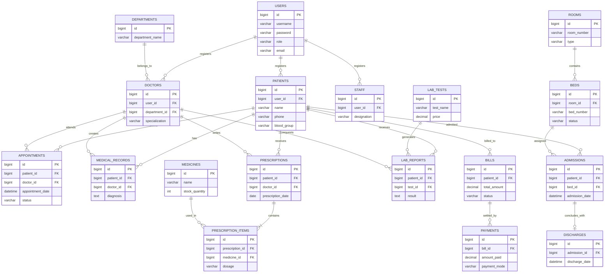

# 🏥 MediCare – Hospital Management System

A comprehensive, web-based **Hospital Management System (HMS)** designed to digitize and streamline hospital operations. MediCare manages end-to-end workflows including patient management, doctor scheduling, appointments, medical records, prescriptions, laboratory tests, room/bed allocations, admissions, discharges, billing, and payments.

---

## 📌 Table of Contents

- [Project Overview](#-project-overview)
- [Key Objectives](#-key-objectives)
- [System Architecture](#-system-architecture)
- [Frontend ↔ Backend ↔ Database Flow](#-frontend--backend--database-flow)
- [User Roles & Access Control](#-user-roles--access-control)
- [Main Features & Modules](#-main-features--modules)
- [Backend Architecture Layering](#-backend-architecture-layering)
- [Database Architecture & 18-Table ER Diagram](#-database-architecture--18-table-er-diagram)
- [REST API Flow Examples](#-rest-api-flow-examples)
- [Aiven MySQL Database Setup](#-aiven-mysql-database-setup)
- [Project Directory Structure](#-project-directory-structure)
- [How to Run the Project](#-how-to-run-the-project)
- [Security Guidelines](#-security-guidelines)
- [Team Contributions](#-team-contributions)
- [Future Scope](#-future-scope)
- [License](#-license)

---

## 🏥 Project Overview

**MediCare HMS** is engineered to eliminate manual record-keeping in healthcare facilities. It connects administrators, medical practitioners, support staff, and patients through a role-based web interface powered by a Java Spring Boot backend and cloud-hosted MySQL database.

### 🛠️ Tech Stack
- **Frontend:** HTML5, CSS3, JavaScript (ES6+), Bootstrap 5
- **Backend Framework:** Java 17+, Spring Boot
- **Database:** MySQL 8.0 (Hosted on Aiven Cloud)
- **Database Connectivity:** Spring Data JPA / Hibernate / JDBC
- **API Architecture:** RESTful APIs (JSON Payload)
- **Database Management:** MySQL Workbench

---

## 🎯 Key Objectives

1. **Digital Operations:** Automate patient intake, consultations, testing, and billing.
2. **Centralized Data:** Maintain an integrated database for 18 core operational entities.
3. **Role-Based Access Control (RBAC):** Ensure data privacy across Admin, Doctor, Staff, and Patient roles.
4. **Cloud Database Management:** Utilize Aiven Cloud MySQL for scalable, reliable remote persistence.
5. **RESTful Architecture:** Maintain strict separation between UI presentation and core business logic.

---

## 🏗️ System Architecture

The system utilizes a 3-tier enterprise architecture pattern:



---

## 🔄 Frontend ↔ Backend ↔ Database Flow



---

## 👥 User Roles & Access Control



| Role | Operational Scope |
| :--- | :--- |
| **Admin** | Full system configuration, department setup, staff management, room allocation, revenue analytics. |
| **Doctor** | Access assigned patients, create medical records, write prescriptions, request lab tests, manage slots. |
| **Staff / Receptionist** | Patient registration, appointment scheduling, room/bed assignments, billing, payment processing. |
| **Patient** | Book appointments, view personal medical history, view lab reports, download prescriptions, view invoices. |

---

## 🚀 Main Features & Modules

### 👨‍💼 1. Admin Module
- Manage doctors, staff members, and system users.
- Configure departments, room types, and hospital bed availability.
- View real-time analytics: Total Patients, Total Doctors, Bed Occupancy, Today's Revenue, Pending Bills.

### 👨‍⚕️ 2. Doctor Module
- View daily consultation schedules.
- Log patient symptoms, diagnoses, and treatment notes.
- Electronic Health Records (EHR) & e-Prescriptions creation.
- Order laboratory diagnostic tests.

### 🧑‍💼 3. Staff & Receptionist Module
- Onboard new patients and search existing patient databases.
- Schedule and confirm appointments based on doctor availability.
- Process IPD admissions, bed allocation, and discharge workflows.
- Generate billing invoices and record cash/UPI/Card payments.

### 👤 4. Patient Module
- Self-registration and login authentication.
- Search doctors by department and book appointment slots.
- Track appointment confirmation status.
- Access prescription records and laboratory diagnostic reports.

---

## ☕ Backend Architecture Layering

The Java Spring Boot backend isolates responsibilities into distinct software layers:

```
+-------------------------------------------------------+
|                 Controller Layer                      |
|   Handles HTTP Requests, Endpoints & DTO Validation   |
+-------------------------------------------------------+
                           │
                           ▼
+-------------------------------------------------------+
|                   Service Layer                       |
|   Contains Core Business Logic & Transactional Rules  |
+-------------------------------------------------------+
                           │
                           ▼
+-------------------------------------------------------+
|                 Repository Layer                      |
|     Spring Data JPA / Repositories for DB Queries     |
+-------------------------------------------------------+
                           │
                           ▼
+-------------------------------------------------------+
|                   Database Layer                      |
|          Cloud Hosted MySQL Engine (Aiven)            |
+-------------------------------------------------------+
```

---

## 🗄️ Database Architecture & 18-Table ER Diagram

The database structure consists of **18 interconnected tables** handling relational operational data.



### Summary of Database Tables

| # | Table Name | Purpose & Function |
| :-: | :--- | :--- |
| **1** | `users` | Stores system authentication credentials and role flags (`ADMIN`, `DOCTOR`, `STAFF`, `PATIENT`). |
| **2** | `patients` | Holds demographic details, contact information, and medical background of patients. |
| **3** | `doctors` | Holds doctor profiles, specializations, consultation fees, and department links. |
| **4** | `staff` | Stores administrative and support staff records. |
| **5** | `departments` | Maintains list of hospital departments (e.g., Cardiology, Neurology, Orthopedics). |
| **6** | `appointments` | Tracks appointment bookings, time slots, assigned doctors, and status flags. |
| **7** | `medical_records` | Stores historical clinical records, diagnoses, and treatment histories. |
| **8** | `prescriptions` | Parent table for prescriptions written by doctors during consultations. |
| **9** | `prescription_items` | Mapping table connecting specific medicines, dosages, and durations to a prescription. |
| **10** | `medicines` | Pharmacy inventory list containing medicine names, stock quantities, and prices. |
| **11** | `lab_tests` | Catalog of available diagnostic tests and their costs. |
| **12** | `lab_reports` | Stores test results, doctor recommendations, and patient report links. |
| **13** | `rooms` | Manages hospital room categories (General, Semi-Private, Private, ICU). |
| **14** | `beds` | Tracks individual bed availability (`AVAILABLE`, `OCCUPIED`, `MAINTENANCE`). |
| **15** | `admissions` | Manages IPD patient admissions and bed assignments. |
| **16** | `discharges` | Logs patient discharge details, summaries, and clearance dates. |
| **17** | `bills` | Aggregates costs for consultation, room stay, lab tests, and pharmacy. |
| **18** | `payments` | Records payment transactions, payment modes (Cash, Card, UPI), and receipts. |

---

## 🔗 REST API Flow Examples

### 1. Booking an Appointment
```
[ Frontend Form ]
       │
       ▼  POST /api/appointments
[ AppointmentController ]
       │
       ▼  validate & pass request DTO
[ AppointmentService ]
       │
       ▼  save entity
[ AppointmentRepository ] ──► [ Aiven Cloud MySQL ]
                                       │
                                       ▼ (Saved)
[ Return Status 201 Created ] ◄────────┘
```

### Core API Endpoints

```
Authentication
POST   /api/auth/login             - Authenticate user credentials

Patients & Doctors
GET    /api/patients               - Fetch list of registered patients
POST   /api/patients               - Register a new patient
GET    /api/doctors                - Retrieve list of doctors by department

Appointments
POST   /api/appointments           - Book a new appointment
GET    /api/appointments/{id}      - Retrieve appointment details
PUT    /api/appointments/{id}      - Update appointment status (Confirm/Cancel)

Clinical Records & Billing
POST   /api/prescriptions          - Create doctor prescription
POST   /api/lab-reports            - Upload diagnostic report
POST   /api/bills                  - Generate bill for patient discharge
POST   /api/payments               - Record payment transaction
```

---

## ☁️ Aiven MySQL Database Setup

The backend connects to a MySQL instance hosted on **Aiven Cloud**.

### Application Properties Configuration
Do not hardcode credentials in your code. Use environment variables in `src/main/resources/application.properties`:

```properties
# Spring Datasource Configuration
spring.datasource.url=${DB_URL}
spring.datasource.username=${DB_USERNAME}
spring.datasource.password=${DB_PASSWORD}

# Hibernate / JPA Setup
spring.jpa.hibernate.ddl-auto=update
spring.jpa.show-sql=true
spring.jpa.properties.hibernate.dialect=org.hibernate.dialect.MySQLDialect
```

### Local Environment Variables Example
```bash
DB_URL=jdbc:mysql://<AIVEN_HOST>:<AIVEN_PORT>/defaultdb?sslMode=REQUIRED
DB_USERNAME=avnadmin
DB_PASSWORD=YOUR_SECURE_AIVEN_PASSWORD
```

---

## 🗂️ Project Directory Structure

```
hospital-management-system/
│
├── backend/
│   ├── src/
│   │   └── main/
│   │       ├── java/
│   │       │   └── com/hospital/
│   │       │       ├── controller/             # REST API Controllers
│   │       │       ├── service/                # Business Logic Interfaces & Impls
│   │       │       ├── repository/             # Spring Data JPA Repositories
│   │       │       ├── entity/                 # 18 Database JPA Entities
│   │       │       ├── dto/                    # Request/Response Data Transfer Objects
│   │       │       ├── config/                 # Security & CORS Configurations
│   │       │       └── HospitalApplication.java
│   │       │
│   │       └── resources/
│   │           └── application.properties       # Spring Configuration
│   │
│   └── pom.xml                                 # Maven Dependencies
│
├── frontend/
│   ├── css/                                    # Stylesheets
│   ├── js/                                     # JavaScript & API Fetch Handlers
│   ├── pages/                                  # Modular Page Views
│   └── index.html                              # Entry Point
│
├── database/
│   └── Hospital_Management_Database.sql        # Database Initialization Script
│
├── .gitignore
└── README.md                                   # Project Documentation
```

---

## ▶️ How to Run the Project

### Prerequisites
- Java JDK 17 or higher
- Apache Maven
- Node.js / Live Server (optional, for serving static frontend files)
- Aiven MySQL Database instance or local MySQL 8.0 server

### 1. Clone the Repository
```bash
git clone https://github.com/YOUR_USERNAME/hospital-management-system.git
cd hospital-management-system
```

### 2. Configure Environment Variables
Set your database credentials in your terminal or environment:
```bash
export DB_URL="jdbc:mysql://YOUR_AIVEN_HOST:PORT/defaultdb?sslMode=REQUIRED"
export DB_USERNAME="avnadmin"
export DB_PASSWORD="YOUR_AIVEN_PASSWORD"
```

### 3. Run the Spring Boot Backend
```bash
cd backend
mvn spring-boot:run
```
The backend server will start on `http://localhost:8080`.

### 4. Launch the Frontend
Open `frontend/index.html` in your browser or run it using a local server extension/tool (e.g., VS Code Live Server).

---

## 🔒 Security Guidelines

1. **Protect Database Secrets:** Never commit your plain text Aiven database password to public repositories.
2. **Environment Variables:** Always source secret keys and connection strings from environment variables.
3. **Password Security:** Store user passwords securely using BCrypt hashing algorithms.
4. **Input Validation:** Sanitize input parameters in controllers to prevent SQL injection and XSS vulnerabilities.
5. **GitIgnore Settings:** Ensure your `.gitignore` includes sensitive properties and target builds:

```gitignore
target/
*.class
.idea/
.vscode/
*.iml
.env
application-local.properties
```

---

## 👨‍💻 Team Contributions

This Hospital Management System is designed and developed as an academic group project.

| Role | Operational Scope & Responsibilities |
| :--- | :--- |
| **Database Architect** | Designed 18-table schema, primary/foreign key relationships, indexing, and Aiven Cloud deployment. |
| **Backend Developer** | Built Java Spring Boot application, REST API endpoints, JPA Repositories, and business logic layers. |
| **Frontend Developer** | Designed user interfaces with Bootstrap, created interactive forms, and integrated REST APIs via Fetch JS. |

---

## 📈 Future Scope

- [ ] **Payment Gateway Integration:** Direct payment link generation via Razorpay/Stripe API.
- [ ] **Automated Notifications:** SMS and Email alerts for appointment confirmations and test results.
- [ ] **PDF Prescription Generator:** Downloadable digital prescriptions and lab reports.
- [ ] **Advanced Analytics Dashboard:** Graphical reporting on revenue, occupancy, and patient trends using Chart.js.
- [ ] **Cloud Deployment:** Complete containerization using Docker and hosting on AWS/Render.

---

## 📜 License

This project is developed for educational and academic presentation purposes.